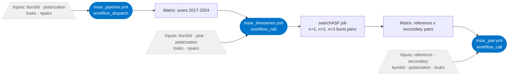
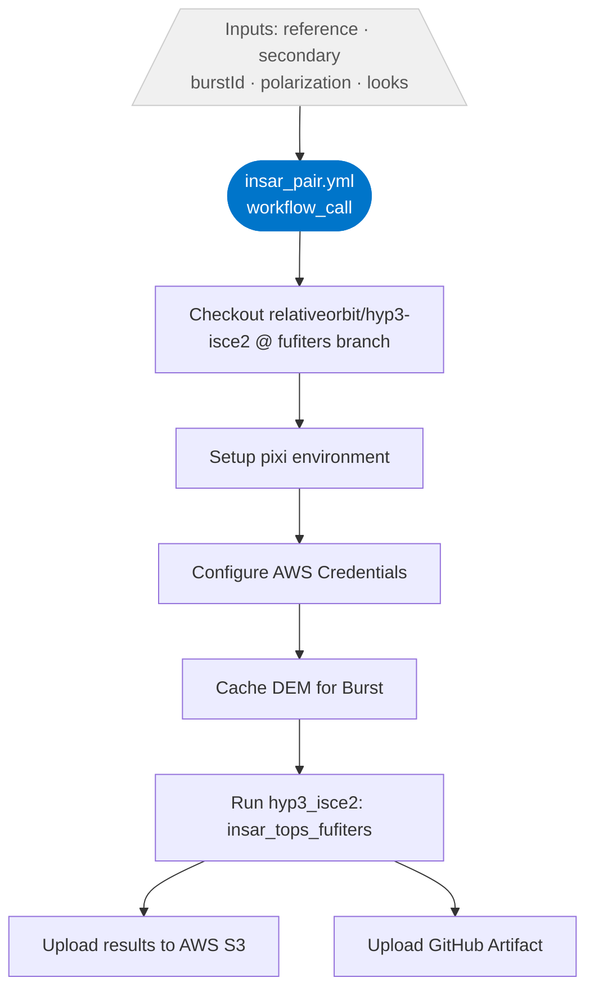

# Overview of processing design

## Reusable workflow hierarchy

| Workflow | Trigger | Calls | Details |
|---|---|---|---|
| **`insar_pair.yml`** | `workflow_dispatch` or `workflow_call` | — | Processes a single reference/secondary SLC pair for one burst; runs `hyp3_isce2`, uploads to S3 & GitHub Artifacts |
| **`insar_timeseries.yml`** | `workflow_dispatch` or `workflow_call` | `insar_pair` (matrix) | Searches ASF for all n+1/n+2/n+3 sequential pairs within a given year, then fans out to `insar_pair` in parallel |
| **`insar_pipeline.yml`** | `workflow_dispatch` | `insar_timeseries` (matrix) | Loops over years **2017–2024** in parallel, calling `insar_timeseries` for each year |

## Architecture diagram

